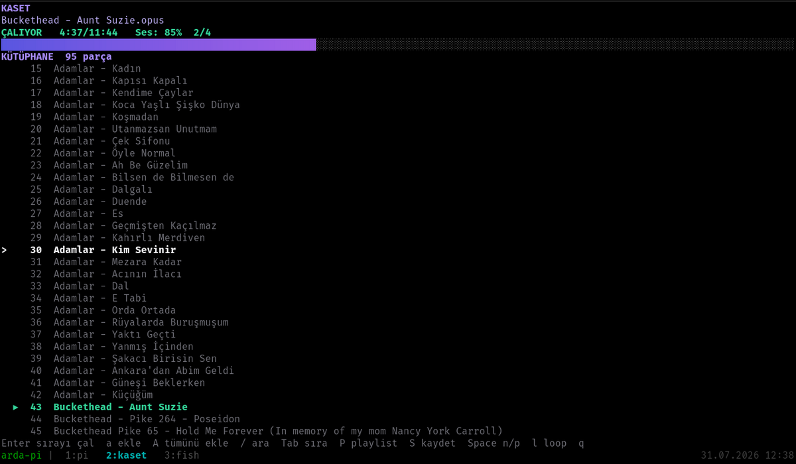
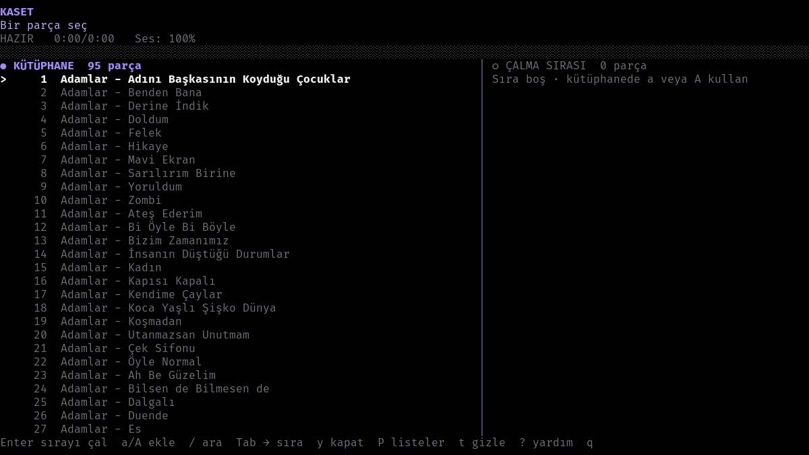

# KASET

<p align="center">
  <strong>Yerel müzik arşivleri için hızlı, klavye odaklı terminal müzik oynatıcı.</strong>
</p>

<p align="center">
  
  
  
</p>

Müzik klasörlerini ve alt klasörlerini tarayan terminal tabanlı müzik oynatıcı.

**Arama · Düzenlenebilir çalma sırası · Kalıcı çalma listeleri · Tek şarkı loop modu**

<p align="center">
  
</p>

## İçindekiler

- [Özellikler](#özellikler)
- [Gereksinimler](#gereksinimler)
- [Kurulum](#kurulum)
- [Kullanım](#kullanım)
- [Kontroller](#kontroller)
- [Çalma sırası](#çalma-sırası)
- [Çalma listeleri](#çalma-listeleri)
- [Veri dosyası](#veri-dosyası)
- [Desteklenen formatlar](#desteklenen-formatlar)
- [Mimari](#mimari)
- [Geliştirme ve test](#geliştirme-ve-test)
- [Sorun giderme](#sorun-giderme)

## Özellikler

- Alt klasörler dahil yerel müzik arşivi taraması
- Arama sonuçlarından doğrudan çalma sırası oluşturma
- Parça ekleme, silme ve yeniden sıralama
- Kaydedilebilir çalma listeleri
- Çalma listelerini kaydetme, yükleme, güncelleme ve silme
- Tek şarkı loop modu
- Oynat/duraklat, ileri/geri sarma, ses ve sessiz mod kontrolleri
- Başlık, sanatçı, albüm, süre ve ilerleme bilgisi
- Dar terminal pencerelerine uyumlu arayüz
- Uygulama kapanırken `mpv` sürecini kapatma

<p align="center">
  
</p>

## Gereksinimler

- Linux
- Go 1.24 veya üzeri
- [`mpv`](https://mpv.io/)
- ANSI renk ve UTF-8 destekli terminal

## Kurulum

### Kaynaktan derleme

Depoyu klonladıktan sonra proje klasöründe çalıştır:

```bash
go build -trimpath -ldflags="-s -w" -o kaset ./cmd/kaset
./kaset ~/Music
```

### Sisteme ekleme

`kaset` komutunu her klasörden çalıştırmak için binary'yi `/usr/local/bin` altına bağla:

```bash
sudo ln -sfn "$(pwd)/kaset" /usr/local/bin/kaset
```

Ardından:

```bash
kaset ~/Music
```

> Binary'yi yeniden derledikten sonra aynı klasörde kaldığı sürece bağlantıyı yenilemek gerekmez.

## Kullanım

```text
kaset [MÜZİK_KLASÖRÜ]
```

```bash
# Müzik klasörünü aç
kaset ~/Music

# Geçerli klasörü tara
kaset .

# Yardımı göster
kaset -h
```

Klasör verilmezse geçerli klasör taranır. Desteklenen bir ses dosyası bulunamazsa uygulama hata mesajıyla kapanır.

## Kontroller

### Oynatma

| Tuş | İşlev |
| --- | --- |
| `Space` | Oynat / duraklat |
| `n` / `p` | Sonraki / önceki parça |
| `←` / `h` | 5 saniye geri sar |
| `→` | 5 saniye ileri sar |
| `l` | Tek şarkı loop modunu aç / kapat |
| `+` / `-` | Sesi artır / azalt |
| `m` | Sessiz modu aç / kapat |
| `s` | Oynatmayı durdur, çalma sırasını koru |
| `q` | Uygulamadan çık |

### Kütüphane

| Tuş | İşlev |
| --- | --- |
| `j` / `k`, `↑` / `↓` | Listede gezin |
| `g` / `G` | Listenin başına / sonuna git |
| `Enter` | Görünen listeyi çalma sırasına al ve seçili parçayı oynat |
| `a` | Seçili parçayı sıranın sonuna ekle |
| `A` | Görünen tüm parçaları sıraya ekle |
| `/` | Aramayı aç |
| `Esc` | Aramayı kapat; ikinci basışta aramayı temizle |
| `t` | Alt paneli gizle / göster |
| `Tab` | Kütüphane ve çalma sırası arasında geçiş yap |

### Çalma sırası

| Tuş | İşlev |
| --- | --- |
| `j` / `k`, `↑` / `↓` | Sırada gezin |
| `g` / `G` | Sıranın başına / sonuna git |
| `Enter` | Seçili parçayı oynat |
| `J` / `K` | Seçili parçayı aşağı / yukarı taşı |
| `x` | Seçili parçayı sıradan çıkar |
| `c` | Sırayı temizle |
| `S` | Sırayı çalma listesi olarak kaydet |
| `Tab` | Kütüphaneye dön |

### Çalma listeleri

| Tuş | İşlev |
| --- | --- |
| `P` | Çalma listelerini aç / kapat |
| `j` / `k`, `↑` / `↓` | Listede gezin |
| `g` / `G` | Listenin başına / sonuna git |
| `Enter` | Seçili listeyi sıraya yükle; silme onayında listeyi sil |
| `x` | Seçili liste için silme onayını aç |
| `Esc` | Silme işlemini iptal et veya ekranı kapat |

## Çalma sırası

Kütüphanede `Enter` tuşu, o anda görünen parçaları yeni çalma sırası yapar ve seçili parçayı başlatır. Arama açıksa yalnızca arama sonuçları kullanılır; ekrandaki sıra korunur.

Parçaları tek tek eklemek için:

1. Kütüphanede parçayı seç.
2. `a` ile sıraya ekle.
3. Gerekirse `A` ile görünen tüm parçaları ekle.
4. `Tab` ile çalma sırasına geç.
5. `J` ve `K` ile sırayı düzenle.
6. `Enter` ile istediğin parçayı başlat.

Loop açıkken şarkı bittiğinde aynı parça yeniden başlar. `l` ile normal akışa dön.

## Çalma listeleri

`S` tuşu mevcut çalma sırasını kaydeder. Bir ad gir ve `Enter` tuşuna bas.

- Aynı ad zaten varsa üzerine yazmak için onay ister.
- `P` kayıtlı çalma listelerini açar.
- `Enter` seçili listeyi çalma sırasına yükler, oynatmayı başlatmaz.
- Çalma sırası panelinde `Enter` ile parça başlatılır. Henüz bir parça çalmıyorsa `Space` de sırayı başlatır.
- `x` silme onayını açar.
- Silinen liste, o anda yüklenmiş çalma sırasını etkilemez.
- Kütüphanede artık olmayan dosyalar yükleme sırasında atlanır ve sayı olarak bildirilir.

## Veri dosyası

Çalma listeleri şu dosyada saklanır:

```text
$XDG_CONFIG_HOME/kaset/playlists.json
```

`XDG_CONFIG_HOME` tanımlı değilse varsayılan yol:

```text
~/.config/kaset/playlists.json
```

Klasör `0700`, dosya `0600` izinleriyle oluşturulur. Kayıt sırasında önce geçici bir dosya yazılır, ardından asıl dosyanın yerine alınır.

Örnek:

```json
{
  "version": 1,
  "playlists": [
    {
      "name": "Gece",
      "tracks": [
        "/home/user/Music/track-one.flac",
        "/home/user/Music/track-two.opus"
      ]
    }
  ]
}
```

Listeler tam dosya yollarını saklar. Bir dosyayı taşırsan veya yeniden adlandırırsan KASET o parçayı atlar.

## Desteklenen formatlar

```text
mp3  flac  ogg  opus  m4a  aac  wav  wma  ape
```

Dosyanın oynatılabilmesi, sistemindeki `mpv` kurulumuna bağlıdır.

## Mimari

```text
kaset/
├── cmd/kaset/          Komut satırı girişi ve uygulama yaşam döngüsü
├── internal/library/   Müzik klasörü taraması
├── internal/player/    mpv ve JSON IPC bağlantısı
├── internal/queue/     Çalma sırası
├── internal/playlist/  JSON çalma listesi deposu
└── internal/tui/       Terminal arayüzü
```

Kullanılan temel bileşenler:

- [`Bubble Tea`](https://github.com/charmbracelet/bubbletea) · Terminal arayüzü
- [`Bubbles`](https://github.com/charmbracelet/bubbles) · Arayüz bileşenleri
- [`Lip Gloss`](https://github.com/charmbracelet/lipgloss) · Terminal stilleri
- [`mpv JSON IPC`](https://mpv.io/manual/stable/#json-ipc) · Oynatma kontrolü ve durum bilgisi

KASET, `mpv`yi tek bir süreç olarak ve `--no-config` ile başlatır. Terminal veya uygulama beklenmedik biçimde kapanırsa `mpv`nin arka planda kalmaması için kapatma sinyalleri kullanır.

## Geliştirme ve test

```bash
# Tüm testler
go test ./...

# Veri yarışı kontrolü
go test -race ./...

# Statik analiz
go vet ./...

# mpv kullanan entegrasyon testleri
KASET_INTEGRATION=1 go test \
  -run 'Test(PlayerIntegration|ParentDeathStopsMPV)$' \
  ./internal/player

# Release binary
go build -trimpath -ldflags="-s -w" -o kaset ./cmd/kaset
```

## Sorun giderme

### `mpv PATH içinde bulunamadı`

`mpv`yi paket yöneticinle kur ve kurulumu kontrol et:

```bash
mpv --version
```

### Desteklenen ses dosyası bulunamadı

Doğru klasörü verdiğini ve uzantının desteklenen formatlardan biri olduğunu kontrol et:

```bash
kaset /müzik/klasörü
```

### Çalma listesinde bazı parçalar yok

Çalma listeleri dosya yolunu saklar. Dosya taşındıysa veya yeniden adlandırıldıysa eski yol geçersiz kalır. KASET bu parçaları atlar.

### Uygulama kapandıktan sonra ses devam ediyor

Çalıştırdığın `kaset` komutunun güncel binary'yi gösterdiğini kontrol et:

```bash
readlink -f /usr/local/bin/kaset
```
